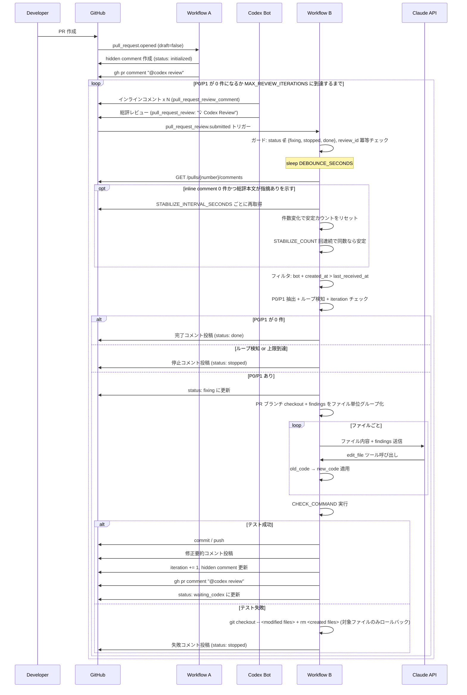

# 推奨フローと状態管理

## 推奨フロー

### 1. PR 作成
PR が作成されたら、GitHub Actions が起動する。

**PoC 実測:** PR #7 で Workflow A が hidden comment を作成し、`CODEX_REVIEW_REQUEST_TOKEN` 経由で `@codex review` を投稿できることを確認した。

処理:
- iteration_count を 0 で初期化
- PR 用の状態情報を作成
- `@codex review` を投稿して Codex の初回レビューを起動
  - `CODEX_REVIEW_REQUEST_TOKEN` 設定時は接続済みユーザー PAT で投稿する
  - 未設定時は `GITHUB_TOKEN` に fallback する
- `status` を `initialized` に設定

---

### 2. Codex レビュー受信
Codex がレビューを投稿したら、GitHub Actions / webhook がそれを検知する。

ただし、**受信直後には Claude を起動しない**。

処理:
- 最新の Codex review を検知
- その review_id と受信時刻を状態として保存
- 一定時間待機する
- 待機後に、その review に含まれる本文・インラインコメントを集約
- P0 / P1 のみ抽出
- P0 / P1 が 0 件なら終了
- 1 件以上あれば Claude 修正フローを起動

---

### 3. デバウンス待機
Codex はインラインコメントを **1件ずつ個別に投稿する** ため、全指摘が出揃うまで待機が必要。

**トリガー戦略:**
- Workflow B は **`pull_request_review.submitted`（総評レビュー）を主トリガーにする**
- 互換用に **`issue_comment.created`（総評コメント）** も許可する
- 総評レビュー/コメントとインラインコメントの投稿順序が保証されない場合に備え、`DEBOUNCE_SECONDS` で追加待機する

推奨値:
- 初期値は **`DEBOUNCE_SECONDS`（デフォルト: 90）** で制御
- 総評コメントが最後に来ることが PoC で確認できれば、短縮または 0 に設定可能

**PoC 実測:** PR #7 では Codex の総評 review が投稿され、続けて inline comment が投稿された。デフォルト待機で Workflow B は P1 を取得できた。`DEBOUNCE_SECONDS=0` への短縮は未検証のため、本番移植前に判断する。

目的:
- 全インラインコメントが出そろうのを待つ
- 途中状態で Claude を動かさない

#### PoC での検証事項

1. **`@codex review` の起動確認:** `gh pr comment` で `@codex review` を投稿した際に、Codex が確実にレビューを開始するか確認する。メンション形式・コメント本文のフォーマットが Codex 側の要件に合致しているか検証する
2. 総評レビュー（`pull_request_review`）または総評コメント（`issue_comment`）とインラインコメント（`pull_request_review_comment`）の投稿順序
3. trigger が来た時点で全インラインコメントが既に投稿済みか
4. 上記が安定しているなら `DEBOUNCE_SECONDS=0` に短縮可能
5. **セーフガード（件数安定方式）:** デバウンス後にインラインコメントが 0 件で、かつ総評コメント本文に指摘の存在を示す文言（例: "suggestions"）が含まれる場合、**件数安定ポーリング**を行う。具体的には、`STABILIZE_INTERVAL_SECONDS`（デフォルト: 10）秒間隔でインラインコメント数を再取得し、**連続 `STABILIZE_COUNT`（デフォルト: 3）回コメント数が変化しなければ安定と判定**する。ポーリングの最大待機時間は `DEBOUNCE_SECONDS` と同じ値とし、超過した場合はその時点のコメント数で処理を続行する。Codex が総評を先に投稿しインラインコメントを後から投稿する挙動に変わった場合の保険。安定判定後もインラインコメントが 0 件の場合は、正常終了（P0/P1 なし）として処理する

#### デバウンス実装の注意点

GitHub Actions 内で `sleep $DEBOUNCE_SECONDS` を使う場合、**ランナーの課金時間を消費する**。

**PoC 段階:** `sleep` で問題ない。動作確認が目的のため、コスト最適化は後回し。ただし、workflow の job に `timeout-minutes` を設定すること（推奨: 30分）。デバウンス 90秒 + Claude API 呼び出し（ファイル数 × 30-60秒） + CHECK_COMMAND 実行を考慮した値。タイムアウトなしの場合、API 応答待ちや予期しない hang で GitHub Actions の課金時間を大量消費するリスクがある。

**本番移植時の選択肢:**
- デバウンスが不要と判明した場合は削除する
- デバウンスが必要な場合は、`workflow_dispatch` + 外部スケジューラや、GitHub Actions の `schedule` トリガーでのポーリング方式を検討する

---

### 4. Claude 修正

> 詳細な仕様は [Claude 修正エンジン仕様](../specs/claude-fix-engine.md) を参照。

**PoC 実測:** PR #7 で Claude が P1 指摘に対する単一 edit を返し、Workflow B が適用、`CHECK_COMMAND`、commit/push まで成功した。複数 edit、空白正規化、複数マッチ、同一指摘ループ停止はユニットテスト済みだが、PR #7 の E2E では踏んでいない。

処理:
- `status` を `fixing` に更新
- PR ブランチを checkout
- findings をファイル単位でグループ化
- ファイルごとに Claude API（Opus）を呼び出し、`edit_file` ツール呼び出しを受け取る
- 各 `edit_file` の `old_code` → `new_code` をファイルに適用（適用失敗時の挙動は [Claude 修正エンジン仕様](../specs/claude-fix-engine.md#応答適用方式-tool-usefunction-calling) を参照）
- 全ファイル適用後、test / lint / typecheck を実行（→ [検証コマンドとロールバック](../operations/check-and-rollback.md)）
- 成功したら commit / push
  - **コミットメッセージ形式:** `fix: auto-resolve P0/P1 findings from Codex review (iteration {N})`。コミット本文には各 `explanation` の要約を箇条書きで記載する。言語は英語で統一する
- PR に修正内容を要約コメント（`gh pr comment`、各 `explanation` を転記。**コメントの言語は英語で統一する**）
- iteration_count を +1
- `last_claude_commit_sha` を更新

---

### 5. Codex 再レビュー
Claude 修正後、CI 成功時のみ `@codex review` を再度投稿する。

処理:
- `@codex review` を投稿して再レビュー依頼
  - `CODEX_REVIEW_REQUEST_TOKEN` 設定時は接続済みユーザー PAT で投稿する
  - 未設定時は `GITHUB_TOKEN` に fallback する
- `status` を `waiting_codex` に更新
- 次のレビューを待つ（Workflow B が再度トリガーされる）

---

### 6. 終了

> 停止条件の詳細は [停止条件とリカバリ](../operations/stop-and-recovery.md) を参照。

#### 正常終了
- 最新 Codex review に P0 / P1 がない
- `status` を `done` に設定し、PR に完了コメントを投稿する

```text
Auto-review completed.

Iterations: 3
All P0/P1 findings have been resolved.
```

- 初回レビューで P0 / P1 が 0 件の場合も同様に正常終了。`iteration_count` は 0 のまま

**PoC 実測:** PR #7 の最終 run で Codex が `Codex Review: Didn't find any major issues.` を投稿し、Workflow B は hidden comment を `status: "done"`, `stopReason: "no_findings"` に更新した。

#### 強制停止
- iteration_count が `MAX_REVIEW_ITERATIONS` に到達

---

### 7. 停止後・完了後の restart

`stopped` または `done(no_findings)` になった後、人間がPRコメントに `/restart-review` または `/restart-review --hard` を投稿すると、Workflow B が restart command として処理する。

処理:
- Workflow B の `issue_comment.created` で `/restart-review` から始まるPRコメントを受け付ける
- Codex bot / `Codex Review` marker 条件には依存しない
- runtime で command body を再parseする
- `trigger-user-login` に対して `AUTO_REVIEW_RESTART_ROLES` の権限チェックを行う
- `readState` 直後、通常の terminal state guard より前に restart handler へ分岐する
- restart handler は hidden state を更新し、`@codex review` を投稿し、受理・拒否のPRコメントを残す
- 同じWorkflow実行内では通常のCodex review処理やClaude fix処理へ進まず、投稿された `@codex review` に対する Codex review を次の Workflow B 実行で処理する

soft restart:
- 対象: `done(no_findings)`, `stopped(...)`, `waiting_codex`
- `status` を `waiting_codex` に戻す
- `stopReason` を `null` に戻す
- `lastProcessedReviewId` を `null` に戻す
- `lastCodexReviewReceivedAt` は保持し、過去の Codex inline comment を再処理しない
- `lastCodexRequestCommentId` を新しい `@codex review` comment ID に更新する
- `iterationCount`、`findingsHashHistory`、`lastClaudeCommitSha`、`lastFindingsHash` は保持する

hard restart:
- soft restart の変更に加え、`iterationCount` を `0`、`findingsHashHistory` を `[]`、`lastFindingsHash` を `null` に戻す

`stopped(state_corrupted)` は state JSON を安全に読めないため restart 不可とし、[停止条件とリカバリ](../operations/stop-and-recovery.md) の手動復旧手順へ誘導する。`initialized` は初期化未完了のため restart 対象外とする。`fixing` は通常処理中の可能性があるため soft restart は拒否するが、運用者が明示的に `/restart-review --hard` を投稿した場合のみ復旧対象にする。

## 状態管理

PR ごとに以下の状態を持つ。

```json
{
  "iteration_count": 3,
  "last_processed_review_id": 123456789,
  "last_claude_commit_sha": "abc123",
  "last_codex_request_comment_id": 999,
  "last_codex_review_received_at": "2026-03-19T10:00:00Z",
  "last_findings_hash": "sha256:abc123...",
  "findings_hash_history": [
    { "iteration": 1, "hash": "sha256:def456..." },
    { "iteration": 2, "hash": "sha256:ghi789..." }
  ],
  "status": "waiting_codex",
  "stop_reason": null
}
```

**各フィールドの説明:**

| フィールド | 用途 |
|-----------|------|
| `iteration_count` | 現在の往復回数。`MAX_REVIEW_ITERATIONS` と比較して強制停止を判定 |
| `last_processed_review_id` | 最後に処理した Codex trigger の ID（`github.event.review.id` または `github.event.comment.id`）。冪等化に使用 |
| `last_claude_commit_sha` | Claude が最後に push した commit SHA。デバッグ用 |
| `last_codex_request_comment_id` | `@codex review` を投稿したコメントの ID。重複投稿防止 |
| `last_codex_review_received_at` | Codex review の受信時刻。インラインコメントの取得範囲フィルタに使用 |
| `last_findings_hash` | 最新 iteration の findings ハッシュ。簡易比較用 |
| `findings_hash_history` | 直近 N 回分（推奨: 3回）の findings ハッシュ。振動パターン（A→B→A）を含むループ検知に使用。最大件数を超えたら古いものから削除する。**hidden comment にはハッシュのみ保持し `normalized_set` は保持しない**（サイズ制限を参照）。ループ検知はハッシュの完全一致のみで判定する（部分一致判定はワークフロー実行中のメモリ上でのみ行う。詳細は [ループ検知](../specs/loop-detection.md) を参照） |
| `status` | 現在の状態（後述の状態遷移を参照） |
| `stop_reason` | 停止理由。`no_findings`（正常終了）、`max_iterations`、`loop_detected`、`claude_api_error`、`test_failure`、`manual_stop` のいずれか |

### 状態遷移

`status` は以下の値を取る。

```
initialized → waiting_codex → fixing → waiting_codex → ... → done / stopped
done/stopped/waiting_codex --/restart-review--> waiting_codex + "@codex review"
done/stopped/waiting_codex/fixing --/restart-review --hard--> waiting_codex + "@codex review" (履歴リセット)
```

| 値 | 意味 | 設定する workflow |
|---|------|-----------------|
| `initialized` | PR 作成直後、hidden comment 作成済み。初回 `@codex review` 投稿**前** | Workflow A（hidden comment 作成時） |
| `waiting_codex` | `@codex review` 投稿済みで Codex のレビューを待っている | Workflow A（初回 review 依頼後）/ Workflow B（修正 push 後） |
| `fixing` | Claude が修正中 | Workflow B（Claude 起動時） |
| `done` | P0/P1 が 0 件で正常終了 | Workflow B |
| `stopped` | 強制停止または異常停止。`stop_reason` に詳細 | Workflow B |

> **補足:** `initialized` と `waiting_codex` を分離することで、Workflow A が hidden comment を作成したが `@codex review` の投稿前に失敗したケースを区別できる。
>
> **`initialized` 状態の検知時の動作:** Workflow B が `initialized` 状態を検知した場合、Workflow A が `@codex review` 投稿前に失敗したことを意味する。この場合、Workflow B は PR にエラーコメント（`"Auto-review initialization incomplete. Workflow A may have failed before posting the initial review request. Please re-run Workflow A or manually post '@codex review'."`）を投稿し、処理をスキップする。**`status` は `initialized` のまま変更しない**（Workflow A の再実行で正常フローに復帰できるようにするため）。自動で `@codex review` を代行投稿しないのは、Workflow A の失敗原因が未解決の可能性があるため。

### 推奨保存先
**PR の hidden comment**

例:

```html
Auto-review state is stored in this comment.

<!-- auto-review-state
{
  "iteration_count": 3,
  "last_processed_review_id": 123456789,
  "last_claude_commit_sha": "abc123",
  "last_codex_request_comment_id": 999,
  "last_codex_review_received_at": "2026-03-19T10:00:00Z",
  "last_findings_hash": "sha256:abc123...",
  "findings_hash_history": [
    { "iteration": 1, "hash": "sha256:def456..." },
    { "iteration": 2, "hash": "sha256:ghi789..." }
  ],
  "status": "waiting_codex",
  "stop_reason": null
}
-->
```

### hidden comment の読み取り方法

GitHub API で PR の全コメントを取得し、`<!-- auto-review-state` を含むコメントを検索する。

```bash
# PR のコメント一覧を取得し、auto-review-state を含むものを抽出
gh api "/repos/{owner}/{repo}/issues/{pr_number}/comments" --paginate \
  --jq '.[] | select(.body | contains("<!-- auto-review-state")) | {id, body}'
```

- Workflow A が初回作成時にこのコメントを投稿する
- Workflow B は毎回このコメントを取得し、JSON をパースして状態を読む
- 状態更新時は同じコメントを `PATCH` で上書きする（`gh api -X PATCH`）
- コメントが見つからない場合は、Workflow A が未実行とみなし処理をスキップする
- GitHub UI 上で空コメントに見えないよう、hidden JSON の前に短い可視テキストを置く

### hidden comment の競合書き込みリスク

GitHub Actions の `concurrency` キューは **最大1つまでしか待機できない**。3つ目以降の workflow 実行は待機中の実行をキャンセルして置き換える。このため、以下の競合パターンが発生しうる:

1. Workflow B-1 が `fixing` に更新して Claude 実行中
2. Codex が次の review を投稿 → Workflow B-2 がキューに入る
3. Codex がさらに review → Workflow B-3 がキュー入り → **B-2 がキャンセル**
4. B-1 完了 → B-3 が起動するが、B-1 の最終状態更新と B-3 の状態読み取りが競合する可能性がある

**PoC 段階の対策:**
- `concurrency` 制御で実用上は十分。短時間に Codex が複数回 review するケースは稀であり、`last_processed_review_id` による冪等化で実質的な影響は軽微
- 追加の対策は不要

本番移植前の追跡 Issue は TY-139。楽観ロック、TOCTOU 対策、`fixing` 更新後のレスポンス検証を実装候補とする。`concurrency` キューや `issue_comment` 互換 trigger の正式方針は TY-142 で判断する。

<details>
<summary><strong>本番移植時の対策（PoC では対応不要）</strong></summary>

- hidden comment の `PATCH` 時に **楽観ロック** を導入する。具体的には、GET で取得した `updated_at` を保持し、PATCH 前に再取得して一致を確認する。不一致の場合はリトライする（最大3回）。または外部ストア（DynamoDB 等）への移行を検討する
- **TOCTOU（Time-of-Check-to-Time-of-Use）競合:** hidden comment の読み取り → `status` チェック → `status` 更新の間に別の workflow 実行が割り込む可能性がある。`concurrency` キューは起動タイミングを制御するが、キュー待機中の workflow が起動する瞬間に先行 workflow の最終状態更新が反映されているかはタイミング依存。楽観ロックに加え、`fixing` への更新を PATCH で行った後に **レスポンスの `body` を検証して、期待通りの更新が行われたことを確認する** 実装を推奨する

</details>

### hidden comment を使う理由
- 外部 DB が不要
- PR に状態が閉じる
- デバッグしやすい
- 人間が追跡しやすい

### hidden comment のサイズ制限

GitHub API のコメント本文は **最大 65,536 文字** に制限される。状態 JSON が肥大化しないよう以下を遵守する。

- `findings_hash_history` にはハッシュ値のみ保持する（`normalized_set` 等の生データは含めない）
- 保持件数は直近 3 回分とし、超過分は古いものから削除する
- 実装時に状態 JSON を書き込む前にサイズチェックを行い、65,000 文字を超える場合は `findings_hash_history` を直近 1 回分に切り詰める

### hidden comment が消失した場合のリカバリ

hidden comment が人間により削除・編集された場合、Workflow B は状態を読み取れなくなる。

**検知:** Workflow B の Phase 1 冒頭で hidden comment が見つからない場合をエラーとして検知する。

**挙動:**
- hidden comment が見つからない場合: Workflow A が未実行とみなし、処理をスキップする（現行の挙動）
- hidden comment の JSON パースに失敗した場合: `status: stopped`, `stop_reason: state_corrupted` で停止し、PR に状態破損を報告するコメントを投稿する
- **リカバリ手順:** 人間が `@codex review` を再投稿するか、hidden comment を手動で再作成する。Workflow A の再実行（`workflow_dispatch` 等）も検討可

---

## シーケンス概要



### Codex inline comment 件数安定化

Codex の総評レビュー/コメントが inline comment より先に到着すると、Workflow B が「P0/P1 なし」と誤判定する可能性がある。PoC では以下の条件を満たす場合だけ、追加 polling で inline comment の件数安定を待つ。

- debounce 後に取得した Codex bot の inline comment 件数が 0 件
- trigger summary body に `P0` / `P1` / `finding` / `issue` / `指摘` / `問題` など、指摘ありを示す可能性がある文言が含まれる
- `No P0/P1 findings` / `no findings` / `0 findings` / `指摘なし` / `問題なし` のように指摘なしを示す文言では polling しない

polling は `STABILIZE_INTERVAL_SECONDS` ごとに行い、Codex bot の inline comment 件数が `STABILIZE_COUNT` 回連続で同じになったら安定とみなす。件数が変化した場合は安定カウントを 0 に戻し、最新の comment 一式を保持する。

最大待機時間は `DEBOUNCE_SECONDS` 相当を上限にする。ただし `DEBOUNCE_SECONDS=0` などで必要な安定確認回数を満たせない場合は、`STABILIZE_INTERVAL_SECONDS * STABILIZE_COUNT` を最低上限として使う。0 件のまま安定した場合は既存フローどおり P0/P1 なしとして処理する。

### 状態遷移図


---

## 関連ドキュメント

- [システム概要](system-overview.md) — 目的・方針・パラメータ
- [イベント設計](event-design.md) — Workflow A/B の詳細
- [ループ検知](../specs/loop-detection.md) — 同一指摘ループの検知アルゴリズム
- [停止条件とリカバリ](../operations/stop-and-recovery.md) — 停止・再開の詳細
- [全ドキュメント索引](../README.md)
