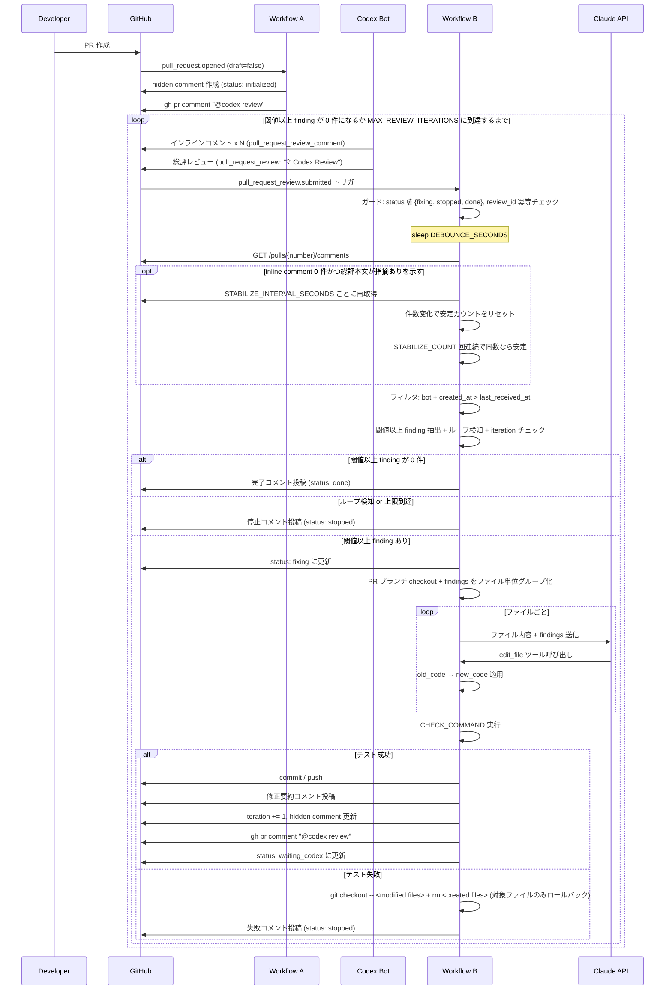
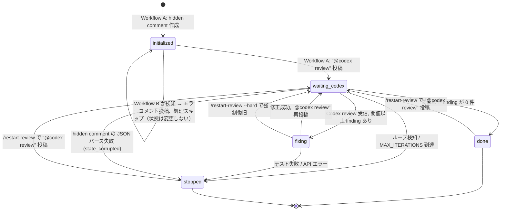

# 推奨フローと状態管理

## 推奨フロー

### 1. PR 作成
PR が作成されたら、GitHub Actions が起動する。

**PoC 実測:** PR #7 で Workflow A が hidden comment を作成し、`CODEX_REVIEW_REQUEST_TOKEN` 経由で `@codex review` を投稿できることを確認した。

処理:
- iteration_count を 0 で初期化
- PR 用の状態情報を作成
- `@codex review` を投稿して Codex の初回レビューを起動
  - `CODEX_REVIEW_REQUEST_TOKEN` 設定時は接続済みユーザー PAT で投稿する
  - 未設定時は `GITHUB_TOKEN` に fallback する
- `status` を `initialized` に設定

---

### 2. Codex レビュー受信
Codex がレビューを投稿したら、GitHub Actions / webhook がそれを検知する。

ただし、**受信直後には Claude を起動しない**。

処理:
- 最新の Codex review を検知
- その review_id と受信時刻を状態として保存
- 一定時間待機する
- 待機後に、その review に含まれる本文・インラインコメントを集約
- `AUTO_REVIEW_SEVERITY_THRESHOLD` 以上の severity のみ抽出（default `P2` → P0/P1/P2 を対象）
- 閾値以上の finding が 0 件なら終了
- 1 件以上あれば Claude 修正フローを起動

---

### 3. デバウンス待機
Codex はインラインコメントを **1件ずつ個別に投稿する** ため、全指摘が出揃うまで待機が必要。

**トリガー戦略:**
- Workflow B は **`pull_request_review.submitted`（総評レビュー）を主トリガーにする**
- 互換用に **`issue_comment.created`（総評コメント）** も許可する
- 総評レビュー/コメントとインラインコメントの投稿順序が保証されない場合に備え、`DEBOUNCE_SECONDS` で追加待機する

推奨値:
- **本番方針 (TY-142 で確定、2026-05-16):** デフォルト `DEBOUNCE_SECONDS=90` を据え置く。`vars.DEBOUNCE_SECONDS=0` への短縮は variable opt-in として許容するが、運用時は 90 を推奨
- 課金影響は 20 iteration × 90s ≈ $0.24 / PR と限定的、PR #7 の安定実績がある
- `STABILIZE_INTERVAL_SECONDS=10` × `STABILIZE_COUNT=3` の安全網 (件数安定ポーリング) と二重化することで、Codex 挙動変化への耐性を維持する

**PoC 実測:** PR #7 では Codex の総評 review が投稿され、続けて inline comment が投稿された。デフォルト待機で Workflow B は P1 を取得できた。

目的:
- 全インラインコメントが出そろうのを待つ
- 途中状態で Claude を動かさない

#### PoC での検証事項

1. **`@codex review` の起動確認:** `gh pr comment` で `@codex review` を投稿した際に、Codex が確実にレビューを開始するか確認する。メンション形式・コメント本文のフォーマットが Codex 側の要件に合致しているか検証する
2. 総評レビュー（`pull_request_review`）または総評コメント（`issue_comment`）とインラインコメント（`pull_request_review_comment`）の投稿順序
3. trigger が来た時点で全インラインコメントが既に投稿済みか
4. `DEBOUNCE_SECONDS=0` への短縮は variable opt-in として許容（TY-142 で確定）。デフォルトは 90 据え置き
5. **セーフガード（件数安定方式）:** デバウンス後にインラインコメントが 0 件で、かつ総評コメント本文に指摘の存在を示す文言（例: "suggestions"）が含まれる場合、**件数安定ポーリング**を行う。具体的には、`STABILIZE_INTERVAL_SECONDS`（デフォルト: 10）秒間隔でインラインコメント数を再取得し、**連続 `STABILIZE_COUNT`（デフォルト: 3）回コメント数が変化しなければ安定と判定**する。ポーリングの最大待機時間は `DEBOUNCE_SECONDS` と同じ値とし、超過した場合はその時点のコメント数で処理を続行する。Codex が総評を先に投稿しインラインコメントを後から投稿する挙動に変わった場合の保険。安定判定後もインラインコメントが 0 件の場合は、正常終了（閾値以上 finding なし）として処理する

#### デバウンス実装の注意点

GitHub Actions 内で `sleep $DEBOUNCE_SECONDS` を使う場合、**ランナーの課金時間を消費する**。

**PoC 段階:** `sleep` で問題ない。動作確認が目的のため、コスト最適化は後回し。ただし、workflow の job に `timeout-minutes` を設定すること（推奨: 30分）。デバウンス 90秒 + Claude API 呼び出し（ファイル数 × 30-60秒） + CHECK_COMMAND 実行を考慮した値。タイムアウトなしの場合、API 応答待ちや予期しない hang で GitHub Actions の課金時間を大量消費するリスクがある。

**本番方針 (TY-142 で確定、2026-05-16):**
- GitHub Actions runner 上の `sleep` を継続採用する。`--max-turns 40` と `timeout-minutes: 30`（TY-140）でコスト天井が明示済みで、debounce 起因の追加リスクは小さい
- event-driven / 外部 scheduler は実装複雑度と Codex 挙動依存リスクが高く、現時点でのコスト削減効果も小さいため採用しない

---

### 4. Claude Code Action 修正（pre-fix → claude-code-action → post-fix）

> 詳細な仕様は [Claude Code Action 実行制御](../operations/security.md#claude-code-action-実行制御) と [`claude-code-repair-request.md`](../specs/claude-code-repair-request.md) を参照。
>
> 旧 [Claude 修正エンジン仕様 (archived)](../_archive/specs/claude-fix-engine.md)（Anthropic SDK + `edit_file` 直適用）は TY-236 / TY-237 で superseded。

**PoC 実測:** PR #7 で旧 `claude-fix-engine` 経路が単一 edit + `CHECK_COMMAND` + commit/push まで成功。新しい claude-code-action 経路は TY-237 / PR #33 で main マージ済み、その後 PR #58（`tests/check-command-allowlist` の意図的 regression）で auto-fix loop の dogfood を実施し TY-232 を完了。徹底的なコードレビュー有効時の E2E は [TY-233](https://linear.app/team-yubune/issue/TY-233) で継続。

`Run auto-fix loop` ステップは `loop/action.yml`（composite）で 3 つに分かれる。`fixing` 状態は **pre-fix の冒頭で確定し、post-fix の終端で `waiting_codex`（成功）か `stopped`（失敗）に遷移する** ため、`fixing` の窓は composite の 1 invocation 内に閉じる。

#### 4-1. pre-fix
- ラベルゲート / `/restart-review` / state guard / debounce / Codex inline comment 取得 / Phase 2 判定（done / max_iterations / loop_detected）を実行
- judge が通過した場合のみ `iteration_count += 1` で `status: fixing` に遷移し、findings から [`buildClaudeCodeRepairRequest`](../specs/claude-code-repair-request.md) → [`buildClaudeCodeRepairPrompt`](../specs/claude-code-repair-request.md) で prompt を組み立てる
- `state.previousCheckFailure` が非 null の場合は prompt の `## Previous CHECK_COMMAND Failure` セクションに転記し、claude-code-action が前回失敗を踏まえた修正を出せるようにする
- GITHUB_OUTPUT に `should_run=true` / `prompt` / `iteration` / `comment_id` などを書き出す。早期 return 時は `should_run=false` を出力

#### 4-2. anthropics/claude-code-action@v1
- `prompt: ${{ steps.pre.outputs.prompt }}` で起動
- `claude_args`: `--model ${{ steps.pre.outputs.model }}` / `--max-turns 40` / `--allowedTools "Read,Glob,Grep,Edit,Write,TodoWrite,Bash(npm ci),Bash(npm run check),Bash(npm test),Bash(npm run build),Bash(git status),Bash(git diff),Bash(git log)"` / `--disallowedTools "WebFetch,WebSearch,Task,NotebookEdit"`
- pre-fix が iteration ごとに `selectModel` (TY-241 / TY-242) で base (`CLAUDE_CODE_MODEL_BASE`、default Sonnet) または escalated (`CLAUDE_CODE_MODEL_ESCALATED`、default Opus) を選択する。固定モデル運用は `BASE === ESCALATED` で表現する (専用 override 変数は持たない)
- `git commit` / `git push` を **bash allowlist に含めない**ことで、commit 権限は post-fix に閉じる
- `allowed_bots: ""`（直接呼び出しのみ、bot コメント由来の trigger 経路は使わない）

#### 4-3. post-fix
- claude-code-action の `outcome` を確認:
  - `cancelled` → `git reset --hard HEAD` + `stopped(action_timeout)`
  - `failure` → execution file から max-turns ヒットを推定し、該当時 `stopped(max_turns_exceeded)`、それ以外 `stopped(action_failure)`
- `git diff --numstat HEAD` → [`parseGitNumstat`](../../src/scope-checker.ts) → [`checkScope`](../../src/scope-checker.ts):
  - 違反（`scope_violation`）時は `git reset --hard HEAD` + `stopped(scope_violation)` + PR コメント
  - 受理時は変更ファイル一覧を modifiedFiles として保持
- [`runCheckCommand`](../../src/check-runner.ts) を実行:
  - 失敗時は check-runner が modifiedFiles をロールバックした後、tail を `state.previousCheckFailure` に保存し `stopped(test_failure)`
  - 成功時は `git add -- <modifiedFiles>` → `git commit -m "fix: auto-resolve Codex review findings (iteration {N})"` → `git push`
- 成功 commit 後: `last_claude_commit_sha` を更新、`previousCheckFailure` を `null` にリセット、`stopReason` を `null` にリセット (TY-258: `/restart-review` 経由で持ち越された `max_turns_exceeded` などのエスカレーションシグナルを one-shot にする)、修正サマリ（変更ファイル一覧）を PR コメント、`status: waiting_codex` に更新、`@codex review` を再投稿

---

### 5. Codex 再レビュー
Claude 修正後、CI 成功時のみ `@codex review` を再度投稿する。

処理:
- `@codex review` を投稿して再レビュー依頼
  - `CODEX_REVIEW_REQUEST_TOKEN` 設定時は接続済みユーザー PAT で投稿する
  - 未設定時は `GITHUB_TOKEN` に fallback する
- `status` を `waiting_codex` に更新
- 次のレビューを待つ（Workflow B が再度トリガーされる）

---

### 6. 終了

> 停止条件の詳細は [停止条件とリカバリ](../operations/stop-and-recovery.md) を参照。

#### 正常終了
- 最新 Codex review に閾値以上 finding がない
- `status` を `done` に設定し、PR の **status comment** に完了エントリを追記する

status comment は PR ごとに 1 つだけ作成・更新される単一の可視コメントで、ヘッダー（現在状態 / 最終 commit / 残 findings / 次アクション）と `<details>` 折りたたみの履歴を持つ（[Status comment](#status-comment) 参照）。

- 初回レビューで閾値以上 finding が 0 件の場合も同様に正常終了。`iteration_count` は 0 のまま

**PoC 実測:** PR #7 の最終 run で Codex が `Codex Review: Didn't find any major issues.` を投稿し、Workflow B は hidden comment を `status: "done"`, `stopReason: "no_findings"` に更新した。

#### 強制停止
- iteration_count が `MAX_REVIEW_ITERATIONS` に到達

---

### 7. 停止後・完了後の restart

`stopped` または `done(no_findings)` になった後、人間がPRコメントに `/restart-review` または `/restart-review --hard` を投稿すると、Workflow B が restart command として処理する。

処理:
- Workflow B の `issue_comment.created` で `/restart-review` から始まるPRコメントを受け付ける
- Codex bot / `Codex Review` marker 条件には依存しない
- runtime で command body を再parseする
- `trigger-user-login` に対して `AUTO_REVIEW_RESTART_ROLES` の権限チェックを行う
- `readState` 直後、通常の terminal state guard より前に restart handler へ分岐する
- restart handler は hidden state を更新し、`@codex review` を投稿し、受理・拒否のPRコメントを残す
- 同じWorkflow実行内では通常のCodex review処理やClaude fix処理へ進まず、投稿された `@codex review` に対する Codex review を次の Workflow B 実行で処理する

soft restart:
- 対象: `done(no_findings)`, `stopped(...)`, `waiting_codex`
- `status` を `waiting_codex` に戻す
- `stopReason` は **保持する** (TY-258 で挙動変更)。`max_turns_exceeded` で停止していた場合は次 iteration の [モデル選定](../operations/security.md#escalation-条件-いずれかが真で-escalated-tier) で escalated tier を選ぶためのシグナルとして使う。post-fix が次の clean commit (`waiting_codex` 遷移) に到達した時点で `stopReason: null` にクリアされるので、escalation は one-shot
- `lastProcessedReviewId` を `null` に戻す
- `lastCodexReviewReceivedAt` は保持し、過去の Codex inline comment を再処理しない
- `lastCodexRequestCommentId` を新しい `@codex review` comment ID に更新する
- `iterationCount`、`findingsHashHistory`、`lastClaudeCommitSha`、`lastFindingsHash` は保持する

hard restart:
- soft restart の変更に加え、`iterationCount` を `0`、`findingsHashHistory` を `[]`、`lastFindingsHash` を `null` に戻す。`stopReason` は soft restart と同じく保持する

`stopped(state_corrupted)` は state JSON を安全に読めないため restart 不可とし、[停止条件とリカバリ](../operations/stop-and-recovery.md) の手動復旧手順へ誘導する。`initialized` は初期化未完了のため restart 対象外とする。`fixing` は通常処理中の可能性があるため soft restart は拒否するが、運用者が明示的に `/restart-review --hard` を投稿した場合のみ復旧対象にする。

## 状態管理

PR ごとに以下の状態を持つ。

```json
{
  "iteration_count": 3,
  "last_processed_review_id": 123456789,
  "last_claude_commit_sha": "abc123",
  "last_codex_request_comment_id": 999,
  "last_codex_review_received_at": "2026-03-19T10:00:00Z",
  "last_findings_hash": "sha256:abc123...",
  "findings_hash_history": [
    { "iteration": 1, "hash": "sha256:def456..." },
    { "iteration": 2, "hash": "sha256:ghi789..." }
  ],
  "status": "waiting_codex",
  "stop_reason": null
}
```

**各フィールドの説明:**

| フィールド | 用途 |
|-----------|------|
| `iteration_count` | 現在の往復回数。`MAX_REVIEW_ITERATIONS` と比較して強制停止を判定 |
| `last_processed_review_id` | 最後に処理した Codex trigger の ID（`github.event.review.id` または `github.event.comment.id`）。冪等化に使用 |
| `last_claude_commit_sha` | Claude が最後に push した commit SHA。デバッグ用 |
| `last_codex_request_comment_id` | `@codex review` を投稿したコメントの ID。重複投稿防止 |
| `last_codex_review_received_at` | Codex review の受信時刻。インラインコメントの取得範囲フィルタに使用 |
| `last_findings_hash` | 最新 iteration の findings ハッシュ。簡易比較用 |
| `findings_hash_history` | 直近 N 回分（推奨: 3回）の findings ハッシュ。振動パターン（A→B→A）を含むループ検知に使用。最大件数を超えたら古いものから削除する。**hidden comment にはハッシュのみ保持し `normalized_set` は保持しない**（サイズ制限を参照）。ループ検知はハッシュの完全一致のみで判定する（部分一致判定はワークフロー実行中のメモリ上でのみ行う。詳細は [ループ検知](../specs/loop-detection.md) を参照） |
| `status` | 現在の状態（後述の状態遷移を参照） |
| `stop_reason` | 停止理由。`no_findings`（正常終了）、`max_iterations`、`loop_detected`、`claude_api_error`、`test_failure`、`manual_stop`、`state_corrupted`、`state_conflict`、`action_timeout`、`action_failure`、`scope_violation`、`max_turns_exceeded`、`codex_usage_limit` (TY-229)、`codex_request_failed` (TY-273 #B5) のいずれか。`scope_violation` / `action_timeout` / `action_failure` / `max_turns_exceeded` は claude-code-action 経路で追加された停止理由（[security.md](../operations/security.md#claude-code-action-実行制御) 参照）。`codex_usage_limit` は Codex 外部サービスの quota 通知。`codex_request_failed` は post-fix が `@codex review` の再投稿に失敗した場合の deadlock 回避降格で、人手復旧は `/restart-review` (soft)。TY-258 以降、`/restart-review` でも `stop_reason` をクリアせず保持し、次 iteration のモデル選定 (`previous_max_turns_exceeded`) に使う。post-fix の clean commit 経路で `null` に戻す |
| `previous_check_failure` | 前回 iteration の `CHECK_COMMAND` 失敗 stdout/stderr の末尾（最大 20,000 文字、tail-preserving truncation）。次 iteration の claude-code-action prompt の `## Previous CHECK_COMMAND Failure` セクションに転記される。clean run / claude-code-action 失敗時は `null` |
| `fixingStartedAt` | TY-273 #B4 で追加。pre-fix が Phase 3 で `fixing` 状態を claim した時刻 (ISO 8601)。pre-fix の stale 判定はこのフィールドを参照し (`/restart-review` で保持される `lastCodexReviewReceivedAt` の流用を避ける)、post-fix の各 terminal 遷移 (`waiting_codex` / `done` / `stopped`) で `null` にクリアされる。legacy state には存在せず、`deserializeState` が `null` に normalize する |

### 状態遷移

`status` は以下の値を取る。

```
initialized → waiting_codex → fixing → waiting_codex → ... → done / stopped
done/stopped/waiting_codex --/restart-review--> waiting_codex + "@codex review"
done/stopped/waiting_codex/fixing --/restart-review --hard--> waiting_codex + "@codex review" (履歴リセット)
```

| 値 | 意味 | 設定する workflow |
|---|------|-----------------|
| `initialized` | PR 作成直後、hidden comment 作成済み。初回 `@codex review` 投稿**前** | Workflow A（hidden comment 作成時） |
| `waiting_codex` | `@codex review` 投稿済みで Codex のレビューを待っている | Workflow A（初回 review 依頼後）/ Workflow B（修正 push 後） |
| `fixing` | Claude が修正中 | Workflow B（Claude 起動時） |
| `done` | 閾値以上の finding が 0 件で正常終了 | Workflow B |
| `stopped` | 強制停止または異常停止。`stop_reason` に詳細 | Workflow B |

> **補足:** `initialized` と `waiting_codex` を分離することで、Workflow A が hidden comment を作成したが `@codex review` の投稿前に失敗したケースを区別できる。
>
> **`initialized` 状態の検知時の動作:** Workflow B が `initialized` 状態を検知した場合、Workflow A が `@codex review` 投稿前に失敗したことを意味する。この場合、Workflow B は PR にエラーコメント（`"Auto-review initialization incomplete. Workflow A may have failed before posting the initial review request. Please re-run Workflow A or manually post '@codex review'."`）を投稿し、処理をスキップする。**`status` は `initialized` のまま変更しない**（Workflow A の再実行で正常フローに復帰できるようにするため）。自動で `@codex review` を代行投稿しないのは、Workflow A の失敗原因が未解決の可能性があるため。

### 推奨保存先
**PR の hidden comment**

例:

```html
Auto-review state is stored in this comment.

<!-- auto-review-state
{
  "iteration_count": 3,
  "last_processed_review_id": 123456789,
  "last_claude_commit_sha": "abc123",
  "last_codex_request_comment_id": 999,
  "last_codex_review_received_at": "2026-03-19T10:00:00Z",
  "last_findings_hash": "sha256:abc123...",
  "findings_hash_history": [
    { "iteration": 1, "hash": "sha256:def456..." },
    { "iteration": 2, "hash": "sha256:ghi789..." }
  ],
  "status": "waiting_codex",
  "stop_reason": null
}
-->
```

### hidden comment の読み取り方法

GitHub API で PR の全コメントを取得し、`<!-- auto-review-state` を含むコメントを検索する。

```bash
# PR のコメント一覧を取得し、auto-review-state を含むものを抽出
gh api "/repos/{owner}/{repo}/issues/{pr_number}/comments" --paginate \
  --jq '.[] | select(.body | contains("<!-- auto-review-state")) | {id, body}'
```

- Workflow A が初回作成時にこのコメントを投稿する
- Workflow B は毎回このコメントを取得し、JSON をパースして状態を読む
- 状態更新時は同じコメントを `PATCH` で上書きする（`gh api -X PATCH`）
- コメントが見つからない場合は、Workflow A が未実行とみなし処理をスキップする
- GitHub UI 上で空コメントに見えないよう、hidden JSON の前に短い可視テキストを置く

### hidden comment の競合書き込みリスク

GitHub Actions の `concurrency` キューは **最大1つまでしか待機できない**。3つ目以降の workflow 実行は待機中の実行をキャンセルして置き換える。このため、以下の競合パターンが発生しうる:

1. Workflow B-1 が `fixing` に更新して Claude 実行中
2. Codex が次の review を投稿 → Workflow B-2 がキューに入る
3. Codex がさらに review → Workflow B-3 がキュー入り → **B-2 がキャンセル**
4. B-1 完了 → B-3 が起動するが、B-1 の最終状態更新と B-3 の状態読み取りが競合する可能性がある

**状態更新時の対策:**
- hidden comment 読み取り時に GitHub comment の `updated_at` を保持する
- hidden comment 更新時は PATCH 前に対象 comment を再取得し、保持している `updated_at` と一致する場合だけ PATCH する
- `updated_at` が変わっていた場合は、古い読み取り結果から作った state を上書きせず、即 `state_conflict` で停止する
- 停止時はPRコメントで「別 workflow run が hidden comment を更新したため安全に状態を永続化できなかった」ことを報告する
- PATCH 後はレスポンス body を deserialize し、期待した state と一致することを検証する。一致しない場合は状態更新失敗として扱い、後続の修正処理へ進まない

これにより、古い読み取り結果をもとにした `fixing` への遷移が競合として検知される。`fixing` の獲得に失敗した workflow run は Claude 修正へ進まないため、TOCTOU 競合時の二重修正を防ぐ。

`concurrency` キューや `issue_comment` 互換 trigger の正式方針は TY-142 で判断する。

<details>
<summary><strong>本番移植時の対策（PoC では対応不要）</strong></summary>

- hidden comment の `PATCH` 時に **楽観ロック** を使う。GET で取得した `updated_at` を保持し、PATCH 前に再取得して一致を確認する。不一致の場合は、古い state で上書きせず `state_conflict` で停止する。将来的により強い原子的更新が必要になった場合は外部ストア（DynamoDB 等）への移行を検討する
- **TOCTOU（Time-of-Check-to-Time-of-Use）競合:** hidden comment の読み取り → `status` チェック → `status` 更新の間に別の workflow 実行が割り込む可能性がある。`concurrency` キューは起動タイミングを制御するが、キュー待機中の workflow が起動する瞬間に先行 workflow の最終状態更新が反映されているかはタイミング依存。楽観ロックに加え、`fixing` への更新を PATCH で行った後に **レスポンスの `body` を検証して、期待通りの更新が行われたことを確認する**

</details>

### hidden comment を使う理由
- 外部 DB が不要
- PR に状態が閉じる
- デバッグしやすい
- 人間が追跡しやすい

### hidden comment のサイズ制限

GitHub API のコメント本文は **最大 65,536 文字** に制限される。状態 JSON が肥大化しないよう以下を遵守する。

- `findings_hash_history` にはハッシュ値のみ保持する（`normalized_set` 等の生データは含めない）
- 保持件数は直近 3 回分とし、超過分は古いものから削除する
- 実装時に状態 JSON を書き込む前にサイズチェックを行い、65,000 文字を超える場合は `findings_hash_history` を直近 1 回分に切り詰める

### hidden comment が消失した場合のリカバリ

hidden comment が人間により削除・編集された場合、Workflow B は状態を読み取れなくなる。

**検知:** Workflow B の Phase 1 冒頭で hidden comment が見つからない場合をエラーとして検知する。

**挙動:**
- hidden comment が見つからない場合: Workflow A が未実行とみなし、処理をスキップする（現行の挙動）
- hidden comment の JSON パースに失敗した場合: `status: stopped`, `stop_reason: state_corrupted` で停止し、PR に状態破損を報告するコメントを投稿する
- **リカバリ手順:** 人間が `@codex review` を再投稿するか、hidden comment を手動で再作成する。Workflow A の再実行（`workflow_dispatch` 等）も検討可

---

## Status comment

auto-review の進行状況を人間が追いやすくするため、PR ごとに **1 件だけ作成・更新される可視のステータスコメント** を維持する。`src/status-comment.ts` の `upsertStatusComment` がこの単一コメントの find-or-create + update をハンドリングする。

### 責務分離（hidden state comment との違い）

| | hidden state comment | status comment |
|---|---|---|
| 目的 | workflow が次 iteration の挙動を決めるための機械可読 state | 人間がPRで最新状態を一目で把握するための可視レポート |
| マーカー | `<!-- auto-review-state` | `<!-- auto-review-status -->` |
| 担当モジュール | `src/state-manager.ts` | `src/status-comment.ts` |
| 楽観ロック | 必要（preflight GET → PATCH、412 検出） | 不要（人間向け表示。複数 worker が同時に書く想定はないが、競合してもデータロスは最小限） |
| 件数 | PRごとに 1 件 | PRごとに 1 件 |
| 内容 | JSON のみ | 可視 markdown ヘッダー + `<details>` 履歴 + 末尾の hidden JSON データブロック |

### 形式

```markdown
<!-- auto-review-status -->
## Auto-review status

**Current**: Fixing — iteration 3 applied
**Last commit**: abc1234
**Open findings**: 2
**Next action**: Awaiting next Codex review.

<details>
<summary>History (3 entries)</summary>

### Iteration 3 — Auto-fix applied
*2026-05-16T01:10:00Z*

- `src/foo.ts`
- `src/bar.ts`

### Auto-fix stopped: CHECK_COMMAND failed
*2026-05-16T01:05:00Z*

…

</details>

<!-- auto-review-status-data
{"current":"...","lastCommit":"abc1234","openFindings":2,"nextAction":"...","entries":[...]}
-->
```

末尾の `auto-review-status-data` ブロックが source of truth。可視 markdown 部はこの JSON から毎回 re-render される。これにより update は「JSON を deserialize → 差分適用 → markdown を rebuild → PATCH」で完結する。

### 更新トリガー

`src/comment-poster.ts` の以下 5 関数が status comment に append する:

| 関数 | エントリ kind | current の遷移 |
|------|---|---|
| `postClaudeCodeActionFixSummary` | `auto_fix_applied` | `Fixing — iteration N applied` |
| `postCompletionComment` | `completed` | `Completed` |
| `postStopComment` | `stopped` | `Stopped — <reason>` |
| `postTestFailureComment` | `test_failure` | `Stopped — CHECK_COMMAND failed after fix` |
| `postInitIncompleteComment` | `init_incomplete` | `Init incomplete` |

`postCodexReviewRequest` (`@codex review`) は status comment に折り込まず、トリガーコメントとして独立して投稿し続ける（Codex 側の検知トリガーになるため）。

### 終了系イベントの通知補強 (TY-259)

GitHub は既存コメントの **edit では通知を発火しない** ため、TY-228 の集約だけでは `done` / `stopped` / `init_incomplete` などの terminal 遷移を人間が見落としやすい。これを補うため、status comment の upsert に加えて以下の関数は **新規の top-level PR コメント** も投稿する:

| 関数 | top-level コメント |
|------|---|
| `postCompletionComment` | ✅ `Auto-review completed` + iteration 数 + status comment への permalink |
| `postStopComment` | 🛑 `Auto-review stopped` + reason label + remaining findings + permalink |
| `postInitIncompleteComment` | ⚠️ `Auto-review initialization incomplete` + 操作ガイド + permalink |

`postClaudeCodeActionFixSummary` と `postTestFailureComment` は **新規コメントを投稿しない**:

- `postClaudeCodeActionFixSummary` は最大 20 回発火しうる iteration 進捗で、増殖回避が TY-228 の主目的だったため集約のみ
- `postTestFailureComment` は CHECK_COMMAND 失敗時に呼ばれるが、その後 post-fix が `postStopComment` を呼ぶ経路があり、そこで通知される

通知用コメントの post は `postTerminalNotification` ヘルパが best-effort で実行する: 失敗しても `core.warning` を 1 行出すだけで status comment の戻り値は維持されるため、状態整合性は壊れない。

### 履歴の上限

`MAX_ENTRIES = 30`。新しい entry は先頭に prepend され、上限を超えた古い entry から落とす。

---

## シーケンス概要



### Codex inline comment 件数安定化

Codex の総評レビュー/コメントが inline comment より先に到着すると、Workflow B が「閾値以上 finding なし」と誤判定する可能性がある。PoC では以下の条件を満たす場合だけ、追加 polling で inline comment の件数安定を待つ。

- debounce 後に取得した Codex bot の inline comment 件数が 0 件
- trigger summary body に `P0` / `P1` / `finding` / `issue` / `指摘` / `問題` など、指摘ありを示す可能性がある文言が含まれる
- `no findings` / `0 findings` / `no issues` / `指摘なし` / `問題なし`、または `No P0 findings` のように指摘なしを示す文言では polling しない（`summaryMayContainFindings` の正規表現は `src/review-collector.ts` を参照）

polling は `STABILIZE_INTERVAL_SECONDS` ごとに行い、Codex bot の inline comment 件数が `STABILIZE_COUNT` 回連続で同じになったら安定とみなす。件数が変化した場合は安定カウントを 0 に戻し、最新の comment 一式を保持する。

最大待機時間は `DEBOUNCE_SECONDS` 相当を上限にする。ただし `DEBOUNCE_SECONDS=0` などで必要な安定確認回数を満たせない場合は、`STABILIZE_INTERVAL_SECONDS * STABILIZE_COUNT` を最低上限として使う。0 件のまま安定した場合は既存フローどおり 閾値以上 finding なしとして処理する。

### 状態遷移図



---

## 関連ドキュメント

- [システム概要](system-overview.md) — 目的・方針・パラメータ
- [イベント設計](event-design.md) — Workflow A/B の詳細
- [ループ検知](../specs/loop-detection.md) — 同一指摘ループの検知アルゴリズム
- [停止条件とリカバリ](../operations/stop-and-recovery.md) — 停止・再開の詳細
- [全ドキュメント索引](../README.md)
